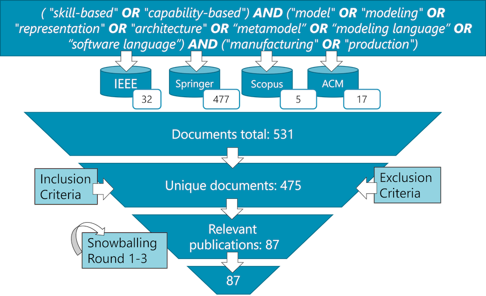

*This is the companion website for the manuscript titled "Skill-Based Manufacturing: A Systematic Mapping Study" currently under submission. After acceptance, this website will be moved into an archive with a persistent DOI, e.g., at [Zenodo](https://zenodo.org/).*

### Motivation

To advance industrial production, researchers are increasingly adopting software-defined manufacturing, a paradigm that decouples manufacturing capabilities from physical hardware—much like mobile operating systems separated app logic from smartphone hardware. Central to this shift is skill-based manufacturing, where production functions are represented as "skills" that define what a system can do rather than how it is physically executed. However, the lack of a unified definition of "skills" across various stakeholders currently hinders the field's progress. To resolve this ambiguity, this paper presents a systematic mapping study of 623 publications, analyzing how skills are defined, what elements constitute them, and how they are applied in practice. By clarifying the distinctions between skills and capabilities, this study provides a structured foundation to help researchers and practitioners build more flexible, resilient, and evolvable production systems.

### Research Method

With this survey, we answer the following research questions

- RQ 1. Who is using skills for which purpose?
- RQ 2. What is a skill?
- RQ 3. How are skills realized?
- RQ 4. How are skills used?

with their 16 sub-questions.

To this end, we have conducted a systematic mapping study using the literature databases and filtering as illustrated below.

We applied the following criteria for filtering articles:

#### Inclusion criteria

1. Publications in peer-reviewed sources, such as journals, conferences, and workshops.
2. Publications accessible electronically.
3. Publications available in English.
4. Publications where we could deduce from the title, abstract, or keywords that the paper is about skill-based or capability-based manufacturing.

#### Exclusion criteria

1. Publications from sources without systematic peer review processes, such as books, magazines, and websites.
2. Short papers of less than four pages excluding references, such as editorials and reviews.
3. Edited volumes and monographs.
4. Studies presenting literature reviews or mapping studies (discussed as related work).
5. Publications where the term “skill” is referring to human skill in the sense of manual labor or “workers.”

Would you like me to convert these lists into a comparison table for easier viewing on your website?

### Corpus

Applying this method has led to a final corpus of 87 publications, which were analyzed to answer the research questions listed above. 

- This corpus is available [here](./corpus.xlsx)

### Related Topics

Find other research topics from my [research](../../research/) website.